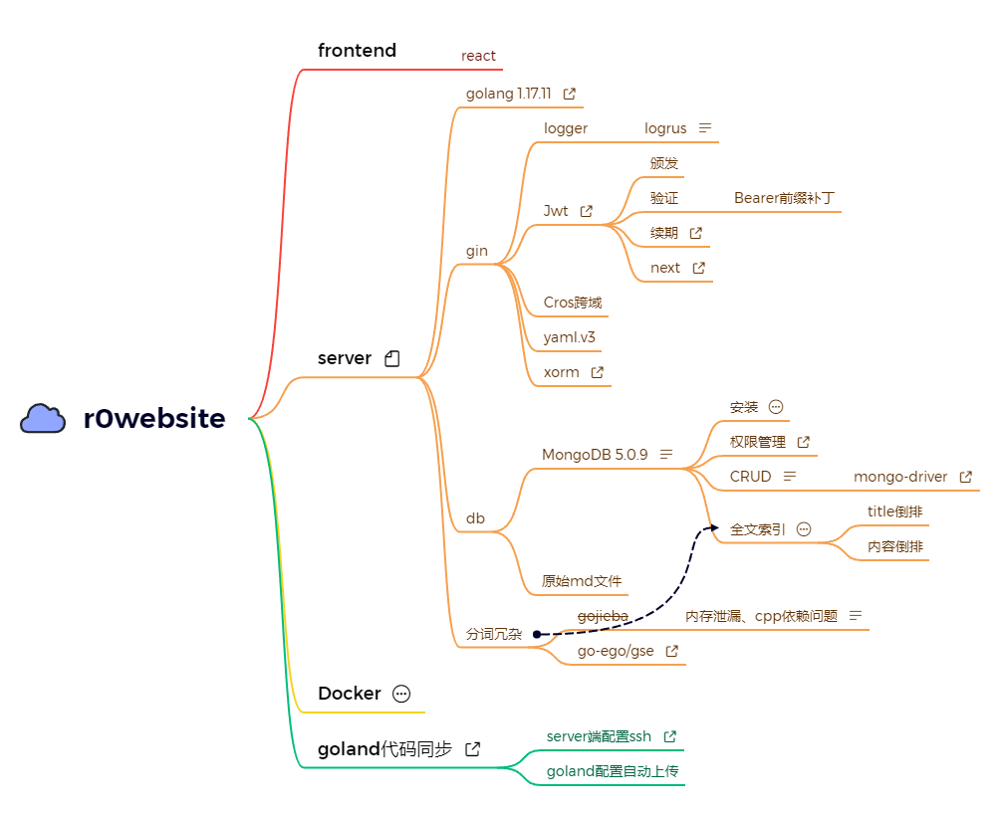
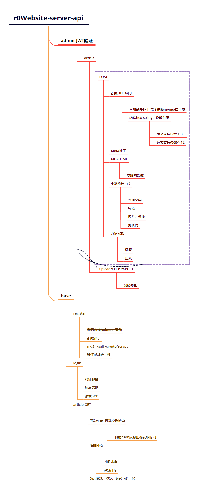

# r0Website-server
   

r0Website server, using Golang development.

个人网站的服务端，使用Golang开发，主要依赖gin框架和MongoDB。

中间件：logrus、jwt，cors。

目前仍在开发中。

## r0Website

个人网站整体开发进度、结构。

-----

## server

server端接口施工进度、方案

-----

## 配置文件

配置文件存放于<code>r0Website-server/config/config.yml</code>，以yaml文件的方式进行配置。

## 数据库

使用MongoDB5.0.9，使用官方driver：[go.mongodb.org/mongo-driver/mongo](go.mongodb.org/mongo-driver/mongo)，直连Database级别，需要在Database配置一个权限至少为 **dbOwner** 的User，并在yaml配置文件中提供。

自动对输入的文章和标题进行中文分词以及冗杂存储，分词结果存储字段分别为<code>md_words</code>和<code>title_words</code>。

分词结果存储字段需设置全文检索（不设置也不会报错，但某些功能可能无法正常运转）。

-----

